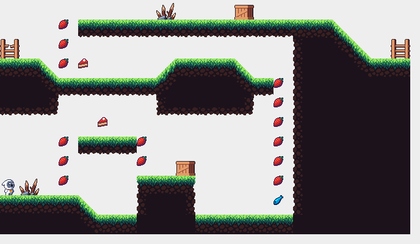
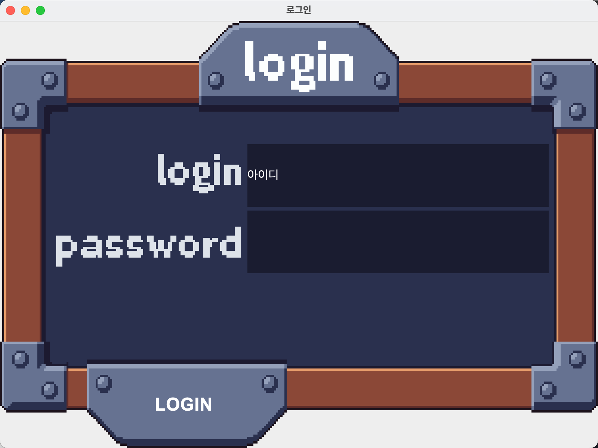
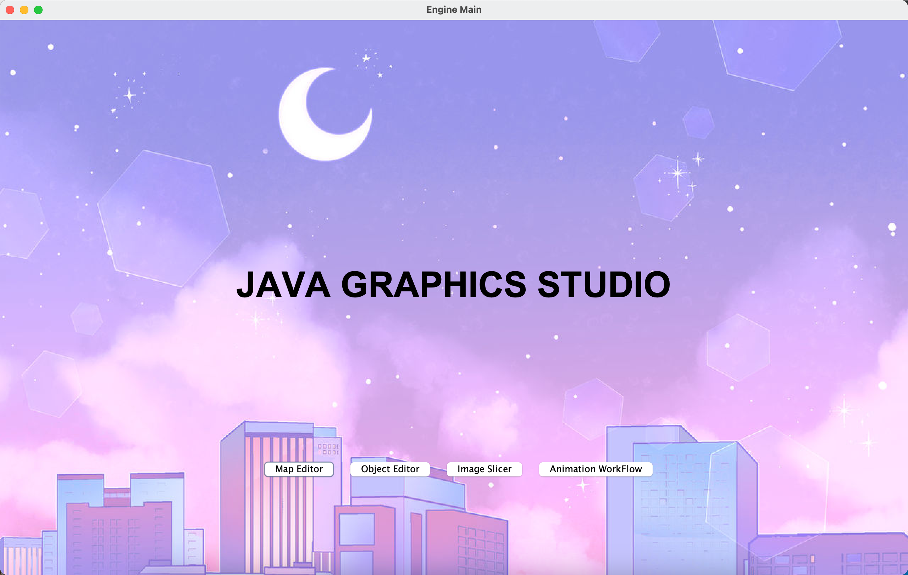
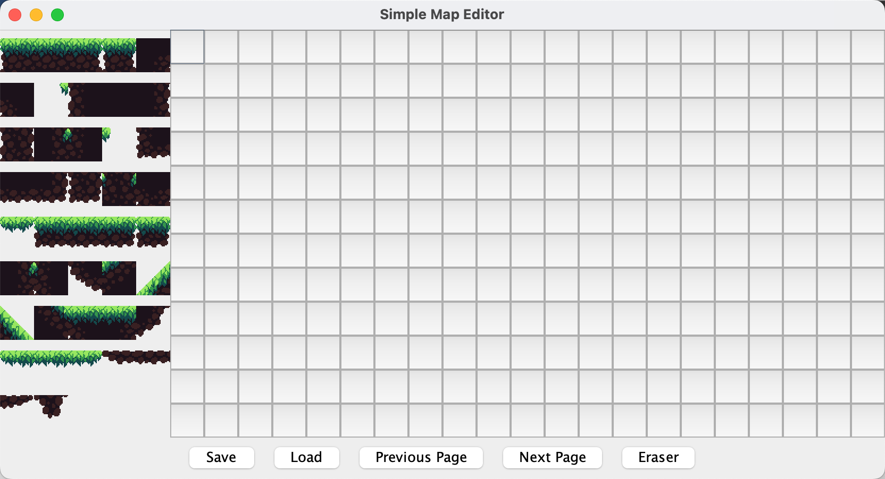
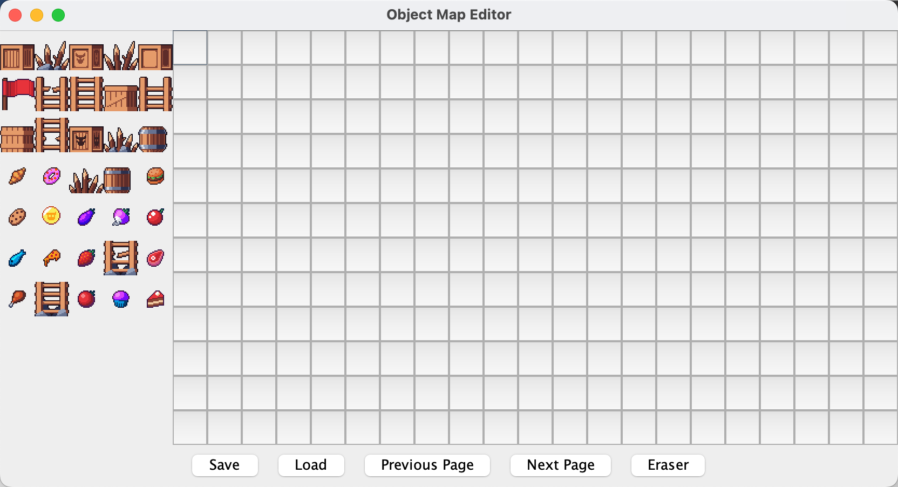
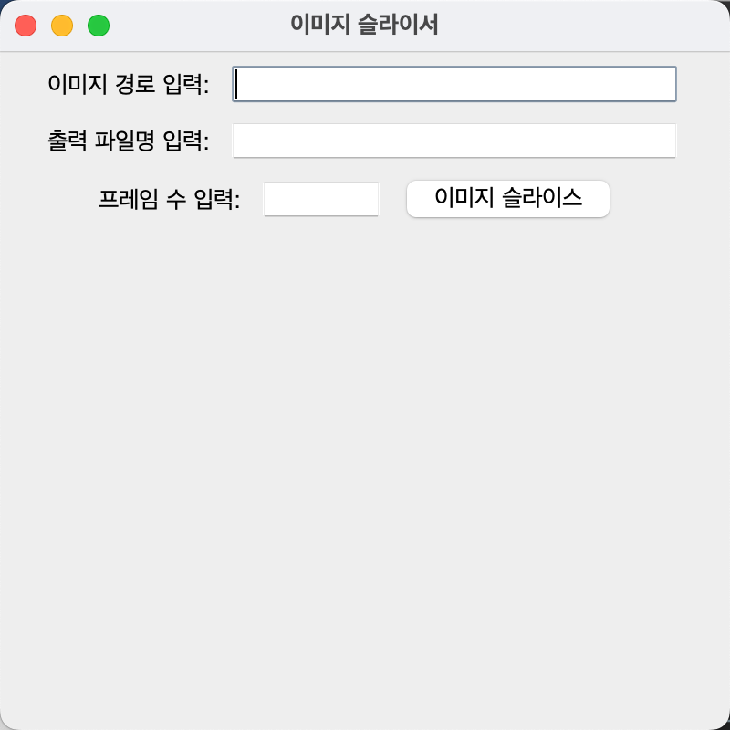
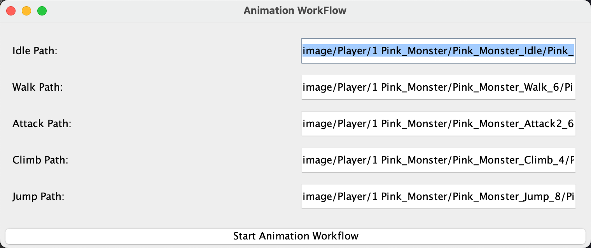

# Seal Breakers

Java Swing으로 만든 2D 플랫폼 어드벤처 팀 프로젝트입니다. 캐릭터를 선택해 스테이지를 탐험하고 봉인된 마법석을 해제하는 게임과, 제작에 사용한 그래픽 도구를 함께 담고 있습니다.

## 구동 화면

### 게임 플레이



### 로그인



### 그래픽 엔진



#### Map Editor

타일 팔레트를 선택해 12×21 그리드에 스테이지 지형을 배치하고 저장·불러오기할 수 있습니다.



#### Object Editor

사다리, 장애물, 아이템 등 게임 오브젝트를 선택해 맵에 배치할 수 있습니다.



#### Image Slicer

스프라이트 시트와 프레임 수를 입력해 애니메이션용 이미지를 프레임 단위로 분할합니다.



#### Animation Workflow

Idle, Walk, Attack, Climb, Jump 이미지를 불러와 캐릭터 애니메이션을 확인합니다.



## 주요 기능

- 캐릭터 선택 후 진행하는 2D 플랫폼 스테이지
- 스테이지 클리어 화면과 게임 진행 UI
- 회원가입·로그인과 MySQL 기반 사용자 관리
- DB 연결 없이 바로 체험할 수 있는 게스트 모드
- 이미지 분할·맵 오브젝트 편집 등 게임 제작 보조 도구

## 프로젝트 배경과 기여 범위

이 저장소는 팀 프로젝트의 [원본 저장소](https://github.com/kimgiwoong127/JAVA-II-PROJCT)를 포크해, 제 기여를 보존하고 현재 환경에서 다시 실행할 수 있도록 정리한 포트폴리오 버전입니다. 원본 커밋 기록은 그대로 유지합니다.

### 제가 담당한 작업

- 회원가입·로그인 화면과 MySQL 사용자 연동
- 캐릭터 선택 흐름과 스테이지 클리어 화면
- 포트폴리오 개선: 게스트 모드가 포함된 실행 런처
- 포트폴리오 개선: 노출된 DB 설정 제거와 환경변수 전환
- 포트폴리오 개선: Java 17 빌드, 테스트, CI, 배포 ZIP과 문서 정비

### 팀 공동·다른 팀원이 담당한 작업

- 핵심 게임 루프, 렌더링과 물리 처리
- 맵·오브젝트 에디터, 이미지 슬라이서와 애니메이션 도구
- 게임 그래픽, 사운드와 기존 스테이지 에셋

따라서 그래픽 엔진과 제작 도구 전체를 제 단독 작업으로 소개하지 않습니다.

## 저작권과 사용 범위

이 포크는 팀 프로젝트 이력과 포트폴리오 시연을 위한 저장소입니다. 별도의 라이선스를 새로 부여하지 않으며, 기존 코드와 에셋의 권리는 각 원저작자에게 있습니다. 제3자가 코드나 에셋을 재사용하려면 해당 권리자의 허락을 확인해야 합니다.

## 실행 방법

Java 17이 필요합니다.

```bash
./gradlew run
```

첫 화면에서 **게스트로 게임 시작**을 선택하면 DB 없이 실행됩니다.

배포용 ZIP은 `./gradlew distZip` 실행 후 `build/distributions/`에 생성됩니다. GitHub Actions의 각 CI 실행에서도 `seal-breakers-커밋SHA` 이름의 동일한 ZIP을 내려받을 수 있습니다.
