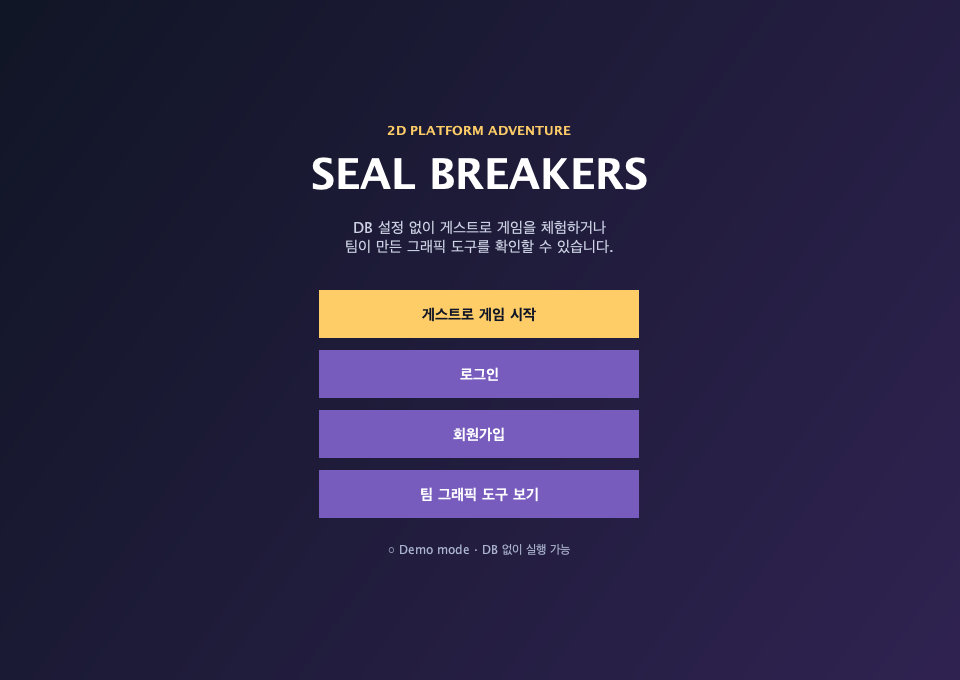

# Seal Breakers

Java Swing으로 만든 2D 플랫폼 어드벤처 팀 프로젝트입니다. 캐릭터를 선택해 스테이지를 탐험하고 봉인된 마법석을 해제하는 게임과, 제작에 사용한 그래픽 도구를 함께 담고 있습니다.



## 본인 기여

- 회원가입·로그인 UI와 MySQL 연동
- 캐릭터 선택 화면
- 게임 클리어 화면
- 포트폴리오 시연용 zero-config launcher와 guest mode
- DB 자격증명 환경변수화, Gradle 실행·패키지 구조와 CI

> 기존 `Engine`의 animation workflow, image slicer, map/object editor는 김기웅 및 다른 팀원의 기여입니다. 프로젝트 전체 기능과 본인 기여를 구분해 표기합니다.

## 실행

Java 17이 필요합니다.

```bash
./gradlew run
```

첫 화면에서 **게스트로 게임 시작**을 선택하면 DB 없이 실행됩니다.

## 회원가입·로그인 DB — 선택

실제 DB 기능을 사용할 때만 다음 환경변수를 설정합니다.

```text
GAME_DB_URL
GAME_DB_USER
GAME_DB_PASSWORD
```

예시는 `config.example`에서 확인할 수 있습니다. 실제 값은 Git에 commit하지 않습니다.

## 테스트와 실행 패키지

```bash
./gradlew test
./gradlew distZip
```

실행 ZIP은 `build/distributions`에 생성되며 실행 라이브러리와 image asset을 포함합니다. 포트폴리오에서는 별도 웹 배포 대신 위 실행 화면 스크린샷과 이 ZIP을 함께 제공합니다.

## Asset

외부 sprite·tile asset의 라이선스 파일은 각 image 하위 폴더에 포함되어 있습니다. 공개 전 사용 조건을 다시 확인합니다.

## 보안

과거 Git 이력에 포함된 DB 자격증명은 코드 수정만으로 무효화되지 않습니다. 해당 DB가 아직 존재한다면 공급자에서 비밀번호를 변경하거나 계정을 폐기해야 합니다.
